# ansible-dz04
Работа с roles

Шаг 1)  Создан vector-role c тегом v1.0.1 To github.com:vegorshkov/vector-role.git:
https://github.com/vegorshkov/vector-role     -  для роли Vector


Шаг 2) При помощи ansible-galaxy скачайте себе эту роль.

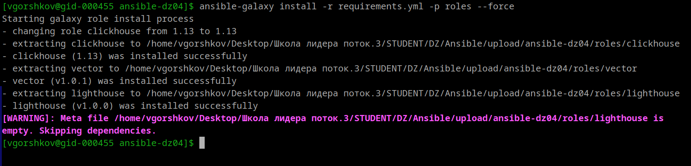

Шаг 3) Создайте новый каталог с ролью при помощи ansible-galaxy role init vector-role.

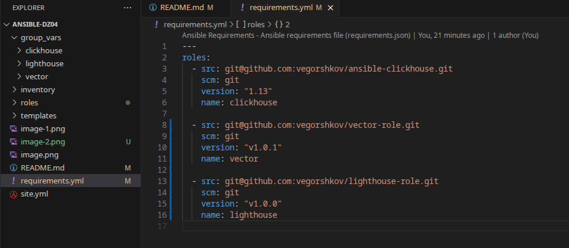

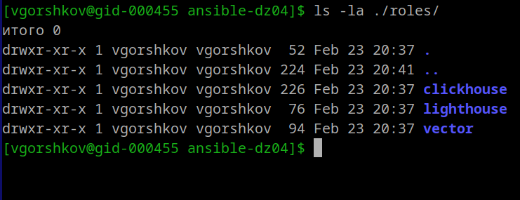

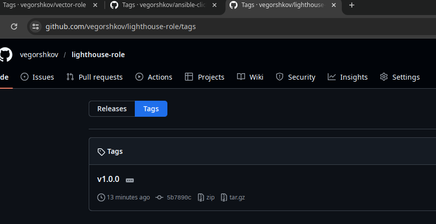

Роли подключены.
Тегирование нормальное.

4) На основе tasks из старого playbook заполните новую role. Разнесите переменные между vars и default.

логика роли lighthouse:
- Установить nginx
- Установить git
- Клонировать репозиторий lighthouse
- Скопировать содержимое в web_root
- Создать nginx конфиг
- Перезапустить nginx

5) Перенести нужные шаблоны конфигов в templates.

6) Опишите в README.md обе роли и их параметры. Пример качественной документации ansible role по ссылке.

7) Повторите шаги 3–6 для LightHouse. Помните, что одна роль должна настраивать один продукт.
    7.1
    7.2
    7.3

8) Выложите все roles в репозитории. Проставьте теги, используя семантическую нумерацию. Добавьте roles в requirements.yml в playbook.

9) Переработайте playbook на использование roles. Не забудьте про зависимости LightHouse и возможности совмещения roles с tasks.

10) Выложите playbook в репозиторий.

Выполнение:
Первый запуск после сборки ролей.
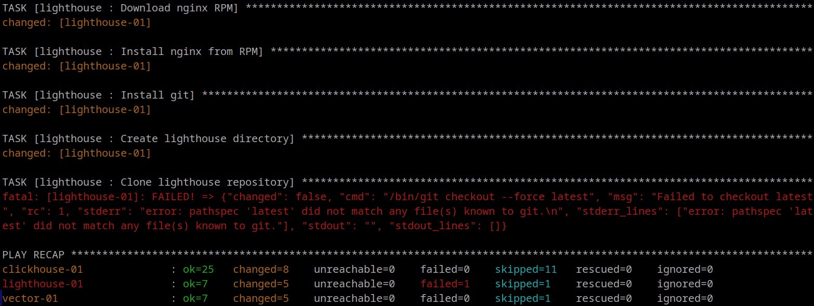

Проверка форка lighthouse 
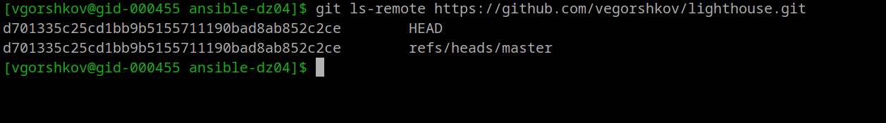

Траблшутинг, удаление после изменения version main на master
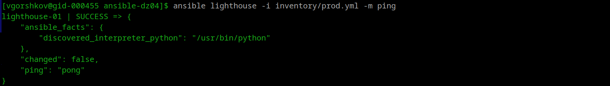
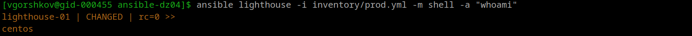
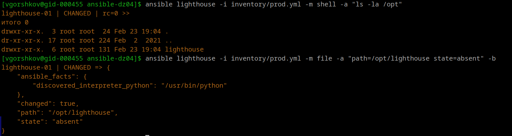


Прошло пересоздание каталога
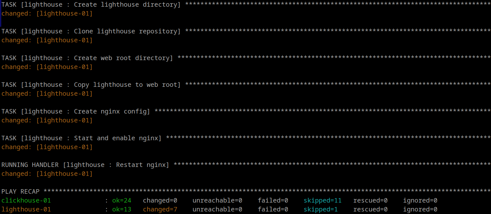

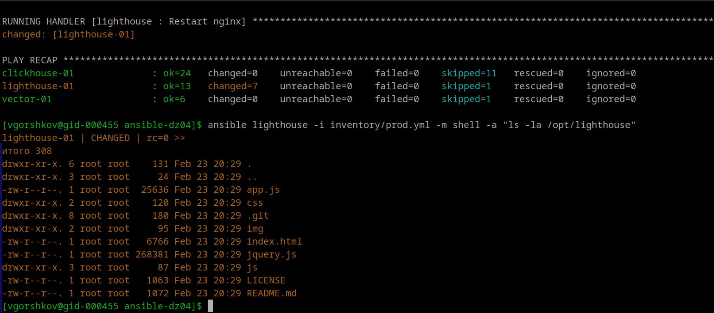

проверка nginx
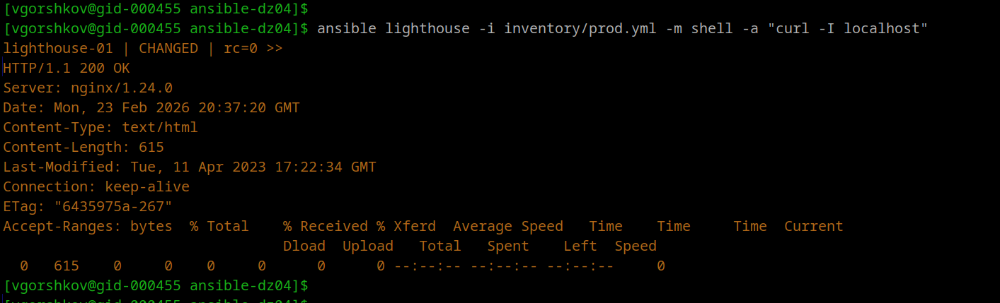

```
HTTP/1.1 200 OK
Server: nginx/1.24.0
Date: Mon, 23 Feb 2026 20:37:20 GMT    (+3 тайм зона)
Content-Type: text/html

```

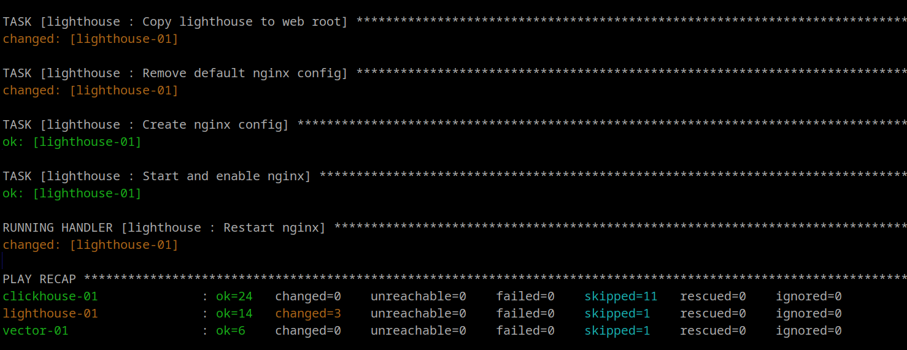

Получилось.

http://158.160.79.100/#http://93.77.190.124:8123/  строка подключения

но клик не слушает 0.0.0.0
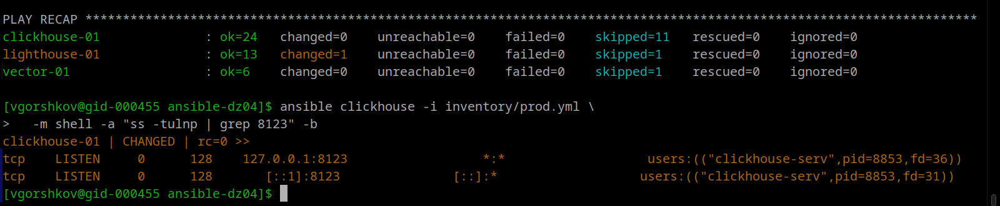


Ответ:
В ответе дайте ссылки на оба репозитория с roles и одну ссылку на репозиторий с playbook.

Репозитории:
https://github.com/vegorshkov/vector-role
https://github.com/vegorshkov/lighthouse
(https://github.com/vegorshkov/ansible-clickhouse)

Playbook:
https://github.com/vegorshkov/ansible-dz04/tree/main 

Готово.

ClickHouse запущен
Vector запущен
Lighthouse запущен
nginx запущен
роли разнесены
inventory скорректирован
разворачивается через playbook
идемпотентность
нет ручных действий
IAC выполнено


