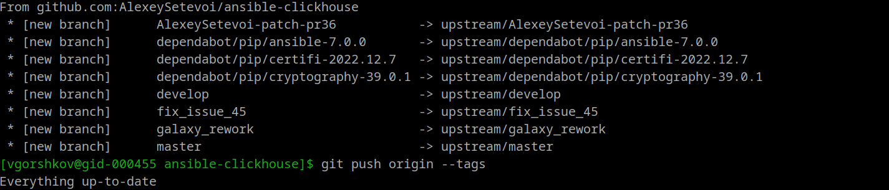
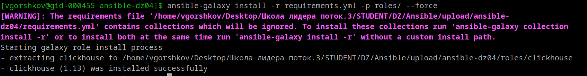

# ansible-dz04
Работа с roles

1)  Созданы три публичных репозитория, а именно:
https://github.com/vegorshkov/ansible-dz04    -  решение дз4
https://github.com/vegorshkov/vector-role     -  для роли Vector
https://github.com/vegorshkov/lighthouse-role -  для роли Lighthouse

2)  Создал в старой версии playbook файл requirements.yml, использовал fork, скопировав теги.

3)  Копирование роли в папку roles, так как  унас указана пока одна роль в requirements.yml:

4)  Для создания или разработки ролей vector-role  и  lighthouse-role   воспользуемся локальным 